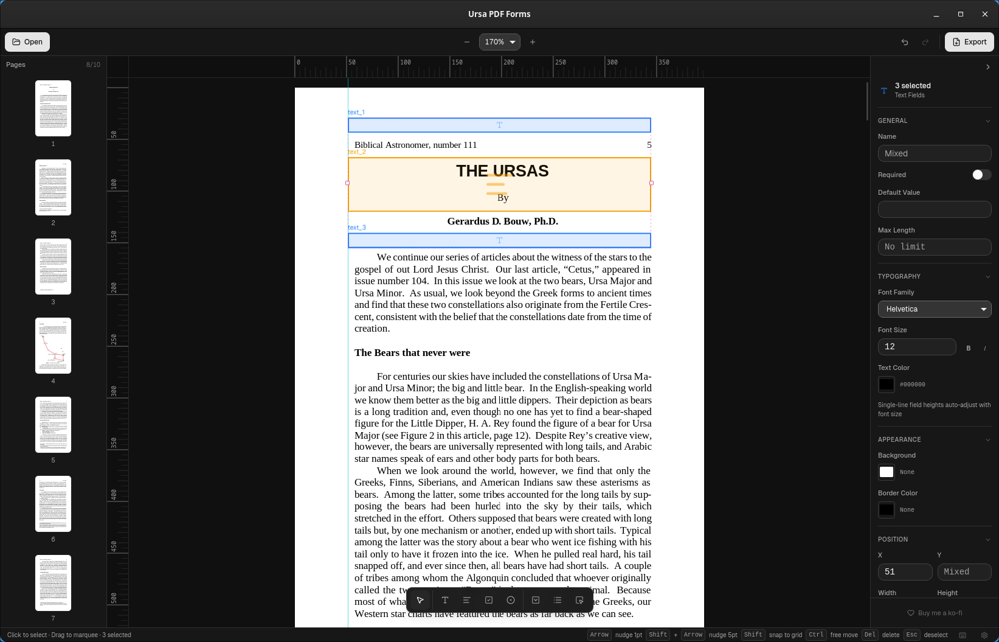

<div align="center">

# Ursa PDF Forms

**A cross-platform tool for placing interactive form fields onto PDF documents and exporting them as fillable PDFs.**
Built with Tauri, React, and TypeScript.

[](https://github.com/BasicallyPolaris/ursa-pdf-forms/actions)
[](LICENSE)
[](https://github.com/BasicallyPolaris/ursa-pdf-forms/releases)

[](https://ko-fi.com/basicallypolaris)

<!-- Uncomment when screenshot is available -->
<!--  -->

[**Download Latest Release**](https://github.com/BasicallyPolaris/ursa-pdf-forms/releases)

</div>

---

## Features

### 📝 Form Fields

- **Text Fields**: Single-line and multi-line text inputs with configurable font size and default values.
- **Checkboxes**: Toggle checkboxes with customizable default state.
- **Radio Buttons**: Grouped radio buttons with mutual exclusion.

### 🎯 Precision Layout

- **Snap Engine**: Grid snapping, page-edge snapping, element-to-element alignment, and ruler guide snapping.
- **Alignment Tools**: Align left/right/top/bottom/center, distribute horizontally/vertically, center on page.
- **Rulers & Guides**: Horizontal and vertical rulers with PDF point tick marks. Drag from ruler to create guide lines.
- **Grid Overlay**: Configurable grid dots for consistent spacing.
- **Numeric Input**: Exact positioning via the properties panel.

### 🛠 Editing

- **Undo/Redo**: Full history support via keyboard shortcuts.
- **Multi-Selection**: Select multiple fields for batch editing and alignment.
- **Drag & Resize**: Direct manipulation of form fields on the PDF canvas.
- **Properties Panel**: Type-specific property editors for quick field configuration.

### 📄 PDF Support

- **Multi-Page Documents**: Navigate and place fields across all pages.
- **Page Thumbnails**: Sidebar with page previews for quick navigation.
- **Export as Fillable PDF**: Generates a standards-compliant PDF with AcroForm fields.
- **PDF Display**: High-fidelity rendering using pdf.js.

## Installation

### Windows, macOS, Linux

Go to the [**Releases Page**](https://github.com/BasicallyPolaris/ursa-pdf-forms/releases) and download the installer for your operating system:

- **Windows**: `.exe` or `.msi`
- **macOS**: `.dmg` or `.app`
- **Linux**: `.deb` or `.AppImage`

> **Note**: As this is an open-source project, the binaries are currently unsigned. You may need to bypass standard security warnings (e.g., "Run Anyway" on Windows or Right Click > Open on macOS) to install.

## Keyboard Shortcuts

| Shortcut            | Action                    |
| ------------------- | ------------------------- |
| `Ctrl+O`            | Open PDF                  |
| `Ctrl+S`            | Save project              |
| `Ctrl+E`            | Export fillable PDF       |
| `Ctrl+Z`            | Undo                      |
| `Ctrl+Shift+Z`      | Redo                      |
| `Delete`            | Delete selected field     |
| `Escape`            | Deselect / Cancel         |

## Development

### Prerequisites

- [Bun](https://bun.sh/) (Preferred package manager)
- [Rust](https://rustup.rs/) (Required for Tauri backend)
- [Tauri Prerequisites](https://tauri.app/start/prerequisites/) (System dependencies for Linux/macOS)

### Setup

```bash
# 1. Clone the repo
git clone https://github.com/BasicallyPolaris/ursa-pdf-forms.git
cd ursa-pdf-forms

# 2. Install dependencies
bun install

# 3. Run development server (Frontend + Rust backend)
bun run tauri dev
```

### Running Tests

```bash
bun run test
```

### Build for Production

To create the installers locally:

```bash
bun run tauri build
```

### Tech Stack

- **Core**: Tauri 2.x (Rust)
- **Frontend**: React 19 + TypeScript
- **Styling**: TailwindCSS 4 + ShadCN + BaseUI
- **PDF Rendering**: pdf.js (pdfjs-dist)
- **PDF Generation**: pdf-lib
- **State Management**: Zustand + zundo (undo/redo)

## Contributing

Contributions are welcome! Please read [CONTRIBUTING.md](CONTRIBUTING.md) for details on our code of conduct, and the process for submitting pull requests.

## License

Distributed under the GPLv3 License. See `LICENSE` for more information.
